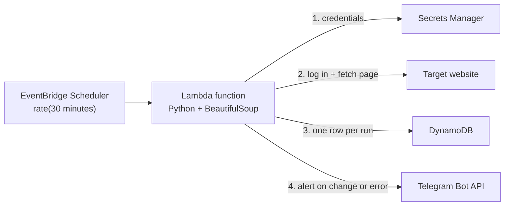

## Title
Building a Serverless Web Scraper on AWS Lambda

## Description
I needed to know the moment a login-protected university housing portal changed, without paying for a server that sits idle all day. Here is how I moved a Python scraper from an always-on EC2 loop to a scheduled Lambda function with Secrets Manager, DynamoDB, Telegram alerts, and one SAM template, for well under a dollar a month.

## Body
## Introduction

Students in Lazio, Italy, apply to DiSCo, the regional agency, for scholarships and university housing. The result appears on a portal behind a login, and it never sends an email. The only way to see a change is to log in again and again.

So I wrote [Lazio Disco Bot](https://github.com/gambhirsharma/lazio-disco-bot). It logs in every 30 minutes, checks the page, and sends me a Telegram message when something changes.

The first version was a Python script running `while True: ...; time.sleep(1800)` on EC2. It worked, but I was paying for a machine to sleep 99.9% of the time, and I had to patch it. A job that runs for a few seconds on a schedule is a textbook Lambda workload, so I rebuilt it.

In this article you will:

- Log in to a site and keep the session with `requests`
- Detect changes by comparing parsed HTML to a baseline
- Keep credentials in AWS Secrets Manager
- Run the scraper on a schedule with EventBridge Scheduler
- Deploy everything with one AWS SAM template

## Architecture overview



EventBridge Scheduler invokes the function every 30 minutes. The function reads its credentials, logs in, and compares the page to a known "nothing new" state. It writes one log row per run and messages Telegram only when something changed or broke. There is no server, queue, or database to manage beyond one on-demand table.

## Prerequisites

- An AWS account and the AWS CLI configured (`aws configure`)
- [AWS SAM CLI](https://docs.aws.amazon.com/serverless-application-model/latest/developerguide/install-sam-cli.html) and Python 3.12+
- A Telegram bot token from [@BotFather](https://t.me/BotFather) and your chat ID
- Credentials for the site you scrape. Check its terms of use first.

## Step 1: Store credentials in Secrets Manager

I keep every secret in one JSON secret. It costs one secret's fee and needs one API call. Replace the placeholder values:

```bash
aws secretsmanager create-secret \
  --name scraper_bot \
  --region eu-south-1 \
  --secret-string '{
    "site_user": "<YOUR_USERNAME>",
    "site_pass": "<YOUR_PASSWORD>",
    "telegram_token": "<YOUR_BOT_TOKEN>",
    "telegram_chat_id": "<YOUR_CHAT_ID>"
  }'
```

I rejected plain Lambda environment variables for the password. They show up in the console to anyone with read access to the function.

## Step 2: Write the handler

This is the whole scraper, `app.py`:

```python
import json
import os
from datetime import datetime, timezone

import boto3
import requests
from bs4 import BeautifulSoup

LOGIN_URL = "https://example.com/login"          # replace
TARGET_URL = "https://example.com/messages"      # replace
BASELINE_TITLE = "27 Giugno 2024"                # what "no news" looks like
BASELINE_TEXT = "Attivazione nuova sezione"

# Runs once per cold start, reused by warm invocations
secret = json.loads(
    boto3.client("secretsmanager").get_secret_value(SecretId="scraper_bot")["SecretString"]
)
table = boto3.resource("dynamodb").Table(os.environ["LOG_TABLE_NAME"])


def notify(text):
    requests.get(
        f"https://api.telegram.org/bot{secret['telegram_token']}/sendMessage",
        params={"chat_id": secret["telegram_chat_id"], "text": text},
        timeout=10,
    )


def log(status):
    now = datetime.now(timezone.utc)
    table.put_item(Item={
        "LogId": f"log-{now:%Y%m%d%H%M%S}",
        "Status": status,
        "Timestamp": now.isoformat(),
    })


def lambda_handler(event, context):
    try:
        with requests.Session() as s:
            s.post(LOGIN_URL, timeout=10,
                   data={"username": secret["site_user"], "password": secret["site_pass"]})
            page = BeautifulSoup(s.get(TARGET_URL, timeout=10).content, "html.parser")

        titles = page.find_all("h5", class_="card-title")
        texts = page.find_all("p", class_="card-text")
        if not titles:
            raise ValueError("No cards found: login failed or the layout changed")

        changed = any(
            t.get_text(strip=True) != BASELINE_TITLE or BASELINE_TEXT not in x.get_text(strip=True)
            for t, x in zip(titles, texts)
        )
        status = "Update" if changed else "No update"
        if changed:
            notify("The portal changed. Go check it!")
        log(status)
        return {"statusCode": 200, "body": status}

    except Exception as e:
        print(f"Error: {e}")
        notify(f"Scraper error: {e}")
        log("Error")
        raise
```

Why it is built this way:

- **`requests.Session`** keeps the login cookie across requests, the same way a browser does. To find the form field names, submit the login form with your browser's DevTools open and look at the request on the Network tab.
- **Baseline comparison** means I don't parse what the change says. I only check that the page no longer looks like "nothing new". That is robust and fits any "tell me when this page changes" job.
- **Module-level setup** runs once per cold start. Warm invocations skip the Secrets Manager call.
- **The `if not titles` check** fixes a real bug in my first version. When the selectors matched nothing, the loop never ran and the bot reported "No update". A broken scraper looked exactly like a quiet day.
- **Re-raising the exception** marks the invocation as failed, so CloudWatch's `Errors` metric and any alarms see it.

I picked `requests` with BeautifulSoup over headless Chromium. The page is server-rendered, so a browser would only add a container image and slower cold starts.

`requirements.txt`:

```text
requests==2.33.0
beautifulsoup4==4.12.3
```

boto3 is already in the Lambda Python runtime. Pin it only if you need a newer version than the runtime includes.

## Step 3: Define the infrastructure with SAM

```yaml
AWSTemplateFormatVersion: '2010-09-09'
Transform: AWS::Serverless-2016-10-31

Resources:
  ScraperFunction:
    Type: AWS::Serverless::Function
    Properties:
      CodeUri: src/
      Handler: app.lambda_handler
      Runtime: python3.12
      Architectures: [arm64]
      Timeout: 30
      MemorySize: 256
      Events:
        Every30Minutes:
          Type: ScheduleV2
          Properties:
            ScheduleExpression: rate(30 minutes)
      Environment:
        Variables:
          LOG_TABLE_NAME: !Ref ScraperLogs
      Policies:
        - DynamoDBWritePolicy:
            TableName: !Ref ScraperLogs
        - Statement:
            Effect: Allow
            Action: secretsmanager:GetSecretValue
            Resource: !Sub arn:aws:secretsmanager:${AWS::Region}:${AWS::AccountId}:secret:scraper_bot-*

  ScraperLogs:
    Type: AWS::DynamoDB::Table
    Properties:
      AttributeDefinitions:
        - AttributeName: LogId
          AttributeType: S
      KeySchema:
        - AttributeName: LogId
          KeyType: HASH
      BillingMode: PAY_PER_REQUEST
```

What I changed from my first template, and why:

| Setting | Before | After | Reason |
| --- | --- | --- | --- |
| Runtime | `python3.9` | `python3.12` | Lambda has deprecated Python 3.9 |
| Timeout | 10 s | 30 s | Login plus page loads on a slow portal went past 10 s |
| Memory | 128 MB | 256 MB | More memory means more CPU, so TLS and parsing run faster |
| Architecture | `x86_64` | `arm64` | Graviton is about 20% cheaper; the dependencies are pure Python |
| IAM | Broad `events:*` on `*` | Removed | `ScheduleV2` creates its own invoke role |

The IAM policy now allows only `PutItem` on one table and `GetSecretValue` on one secret. The `-*` suffix matches the random characters Secrets Manager adds to every secret ARN.

Deploy:

```bash
sam build
sam deploy --guided   # first run: pick stack name and region, confirm IAM changes
```

## Step 4: Test, monitor, and cost

Invoke the deployed function and watch its logs:

```bash
sam remote invoke ScraperFunction --stack-name <YOUR_STACK_NAME>
sam logs -n ScraperFunction --stack-name <YOUR_STACK_NAME> --tail
```

For unit tests, save a copy of the target page's HTML and run the parsing logic on it. The tests then run offline and never log in to the real site.

For monitoring, the DynamoDB table holds one row per run, so a gap means the schedule stopped. Telegram covers errors in real time. A CloudWatch alarm on the function's `Errors` metric is a cheap second net.

Rough monthly cost in `eu-south-1`:

- Lambda: 1,440 runs × ~3 s × 0.25 GB ≈ 1,100 GB-seconds, inside the free tier
- DynamoDB on-demand: 1,440 small writes, a fraction of a cent
- Secrets Manager: about $0.40 for one secret

That is under $0.50 a month, much less than the smallest always-on EC2 instance.

## Best practices and gotchas

1. **Treat "nothing found" as an error.** Empty selector results usually mean a failed login or a new layout, not a quiet day.
2. **Set a timeout on every HTTP call.** Otherwise one hung connection uses up the whole Lambda timeout.
3. **URL-encode notification text.** I built the Telegram URL with an f-string at first. Passing `params=` lets `requests` encode spaces and `&` for you.
4. **Store state instead of hard-coding the baseline.** Saving a hash of the last-seen content in DynamoDB means a redeploy is no longer needed after every change.
5. **Respect the site.** Use a modest schedule and a clear `User-Agent`, and follow its terms. A cron window such as `cron(0/30 7-20 ? * MON-FRI *)` with `ScheduleExpressionTimezone` cuts requests even further.

## Conclusion

I replaced an always-on EC2 script with a scheduled Lambda function. It costs cents a month, needs no patching, and logs every check. The same pattern works for price trackers, appointment slot checks, exam results, or any portal that won't notify you.

Next steps:

1. Store a content hash in DynamoDB and diff against it instead of a fixed baseline.
2. Translate changed text before sending it. My EC2 version used `deep-translator` for Italian to English.
3. Add a Lambda function URL so the bot can answer Telegram commands such as `/status`.

The full project is on GitHub: [gambhirsharma/lazio-disco-bot](https://github.com/gambhirsharma/lazio-disco-bot).

## Tags
aws-lambda, serverless, python, web-scraping, aws-sam

## More options
- Canonical URL: none
- Series: none
- Cover image: A minimalist isometric illustration of a small cloud-shaped function on a clock face, pulling a web page through a funnel and sending a paper-plane notification to a phone, in AWS orange and dark navy.
