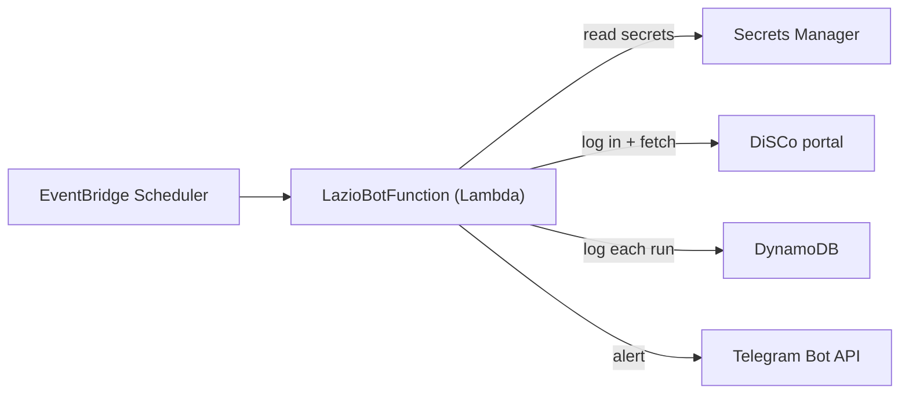

# Title

Building a Serverless Web Scraper on AWS Lambda

# Description

Build a serverless web scraper on AWS Lambda with EventBridge scheduling, Secrets Manager, DynamoDB logging, Telegram alerts, and AWS SAM.

# Body

## Introduction

A scraper that runs for a few seconds every 30 minutes does not need a server running all day. AWS Lambda is a good fit: you pay per invocation, EventBridge handles the schedule, and there is no machine to patch.

This article walks through a real project, [Lazio Disco Bot](https://github.com/gambhirsharma/lazio-disco-bot). Students in Lazio, Italy apply to DiSCo for scholarships and housing. The decision appears on a login-only portal that never sends an email, so the only way to know your status changed is to log in again and again. The bot logs in every 30 minutes, checks the page, and sends a Telegram message on any change.

The reusable pattern:

1. Log in and keep a session with `requests`.
2. Parse the HTML with BeautifulSoup and diff it against a baseline.
3. Store credentials in Secrets Manager.
4. Schedule the function with EventBridge.
5. Log every run to DynamoDB and alert on changes or errors.
6. Deploy the whole stack with one SAM template.

## Architecture



One Lambda function, no servers, all defined in a single SAM template.

## Prerequisites

- An AWS account and the AWS CLI set up with `aws configure`.
- [AWS SAM CLI](https://docs.aws.amazon.com/serverless-application-model/latest/developerguide/install-sam-cli.html) and Python 3.12+.
- A Telegram bot token from [@BotFather](https://t.me/BotFather) and your chat ID.
- Login details for the site you want to scrape. Read its terms of use and keep your request rate low.

## Step 1: Load credentials at cold start

Keep passwords out of code and plain environment variables. Store them as one JSON secret and read it once, at module level, so warm invocations reuse it:

```python
import json
import boto3

def get_secret():
    client = boto3.client("secretsmanager", region_name="eu-south-1")
    return client.get_secret_value(SecretId="Lazio_disco_bot")["SecretString"]

secret = json.loads(get_secret())
USER_ID = secret["lazio_USER"]
PASS = secret["lazio_pass"]
TOKEN = secret["lazio_telegram_bot_token"]
chat_id = secret["lazio_telegram_bot_chat_id"]
```

## Step 2: Log in and scrape

A `requests.Session` keeps the auth cookie and sends it on later requests:

```python
import requests

login_url = "https://dirstudio.laziodisco.it/"
message_url = "https://dirstudio.laziodisco.it/Home/MessaggiDisco"
payload = {"username": USER_ID, "password": PASS}

with requests.session() as s:
    s.post(login_url, data=payload)
    m = s.get(message_url, timeout=10)
```

Find the field names by submitting the login form in your browser and reading the Network tab.

## Step 3: Compare against a baseline

The bot does not try to understand the page. It records what "no news" looks like and alerts on any difference:

```python
from bs4 import BeautifulSoup

fixed_card_title = "27 Giugno 2024"
fixed_card_text = "Attivazione nuova sezione"

page = BeautifulSoup(m.content, "html.parser")
titles = page.find_all("h5", class_="card-title")
texts = page.find_all("p", class_="card-text")

for title, text in zip(titles, texts):
    if (title.get_text(strip=True) != fixed_card_title
            or fixed_card_text not in text.get_text(strip=True)):
        changed = True
```

Pick stable selectors such as CSS classes and headings, not timestamps or session tokens.

## Step 4: Notify and log

Send Telegram messages with `params=` so `requests` URL-encodes the text, and write one row per run to DynamoDB:

```python
from datetime import datetime

def send_message(mess):
    requests.get(
        f"https://api.telegram.org/bot{TOKEN}/sendMessage",
        params={"chat_id": chat_id, "text": mess},
    )

def save_log(status):
    table = boto3.resource("dynamodb").Table("LazioDiscoLogs")
    now = datetime.utcnow()
    table.put_item(Item={
        "LogId": f"log-{now.strftime('%Y%m%d%H%M%S')}",
        "Status": status,
        "Timestamp": now.isoformat(),
    })
```

Wrap the handler in a `try/except` that reports failures to Telegram, so a broken login or changed layout reaches you immediately instead of failing quietly.

## Step 5: Define and deploy with SAM

One `template.yaml` declares the function, schedule, permissions, and log table. `sam build` installs `lazio/requirements.txt` into the package for you.

```yaml
AWSTemplateFormatVersion: '2010-09-09'
Transform: AWS::Serverless-2016-10-31

Globals:
  Function:
    Timeout: 30
    MemorySize: 256

Resources:
  LazioBotFunction:
    Type: AWS::Serverless::Function
    Properties:
      CodeUri: lazio/
      Handler: app.lambda_handler
      Runtime: python3.12
      Architectures:
        - arm64
      Events:
        Every30Minutes:
          Type: ScheduleV2
          Properties:
            ScheduleExpression: rate(30 minutes)
      Policies:
        - DynamoDBWritePolicy:
            TableName: !Ref LazioDiscoLogs
        - Statement:
            Effect: Allow
            Action: secretsmanager:GetSecretValue
            Resource: !Sub arn:aws:secretsmanager:${AWS::Region}:${AWS::AccountId}:secret:Lazio_disco_bot-*
    Environment:
        Variables:
          LOG_TABLE_NAME: !Ref LazioDiscoLogs

  LazioDiscoLogs:
    Type: AWS::DynamoDB::Table
    Properties:
      TableName: LazioDiscoLogs
      AttributeDefinitions:
        - AttributeName: LogId
          AttributeType: S
      KeySchema:
        - AttributeName: LogId
          KeyType: HASH
      BillingMode: PAY_PER_REQUEST
```

Deploy:

```bash
cd lazio-serverless
sam build
sam deploy --guided   # first time
sam deploy            # later deploys reuse samconfig.toml
```

Create the secret before the first deploy, because the function reads it at cold start:

```bash
aws secretsmanager create-secret \
  --name Lazio_disco_bot \
  --region eu-south-1 \
  --secret-string '{"lazio_USER":"user","lazio_pass":"pass","lazio_telegram_bot_token":"123:ABC","lazio_telegram_bot_chat_id":"987654321"}'
```

## Monitoring and cost

- **CloudWatch Logs** capture every `print()` from the handler.
- **DynamoDB** stores one row per run, proving the schedule fired.
- **Telegram** gets a message on errors as well as updates.

At 256 MB and a few seconds per run, 1,440 monthly runs use about 1,000 GB-seconds, well inside the Lambda free tier (400,000 GB-seconds). DynamoDB on-demand writes cost a fraction of a cent. The main cost is the Secrets Manager secret, about $0.40 a month.

## Best practices

1. **Detect broken parsing.** If selectors return nothing, treat it as an error, not "No Update".
2. **Save state, not only logs.** Store a content hash in DynamoDB instead of a hard-coded baseline.
3. **Be a good citizen.** Use a modest schedule, set a clear `User-Agent`, and follow the site's terms and `robots.txt`.
4. **Set request timeouts**, e.g. `s.get(url, timeout=10)`, so hung connections fail fast.
5. **Use a browser only when necessary.** JavaScript-built pages need headless Chromium, which is much heavier.
6. **Reuse clients** by creating boto3 clients at module level.

## Conclusion

Moving Lazio Disco Bot from an always-on script to Lambda took about 100 lines of Python and a 50-line SAM template. It now costs almost nothing, has no server to maintain, and logs every check. Reuse the pattern for price trackers, appointment slot checks, exam result pages, or any portal that never sends notifications.

Next steps: store a content hash in DynamoDB instead of a hard-coded baseline, translate changed text with `deep-translator` before sending, or let the bot answer Telegram commands through a Lambda function URL.

Full source: [gambhirsharma/lazio-disco-bot](https://github.com/gambhirsharma/lazio-disco-bot).

# Tags

aws-lambda, serverless, python, web-scraping, aws-sam

# More options

- Canonical URL: none
- Series: none
- Cover image: A Lambda function icon connected by arrows to a scheduled clock, a database, and a chat bubble, on a clean AWS-orange gradient background.
