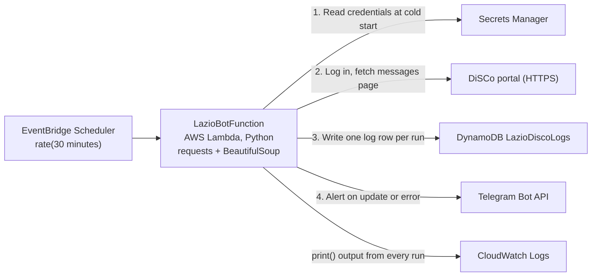

# Building a Serverless Web Scraper on AWS Lambda: Lessons from Lazio Disco Bot

> Build a serverless web scraper on AWS Lambda with EventBridge scheduling, Secrets Manager, DynamoDB logging, Telegram alerts, and AWS SAM.

## Introduction

A scraper that runs for a few seconds every 30 minutes doesn't need a server running all day. It fits AWS Lambda well: you pay per invocation, EventBridge handles the schedule, and there is no machine to patch.

This article walks through a real project, [Lazio Disco Bot](https://github.com/gambhirsharma/lazio-disco-bot). Students in Lazio, Italy, apply to DiSCo, the regional agency, for scholarships and university housing. The decision appears on a portal that sits behind a login and never sends an email. The only way to know your status has changed is to log in again and again. The bot logs in for you every 30 minutes, checks the page, and sends a Telegram message when something changes.

The project started as a Python script in an infinite loop on EC2 (`script.py`). It was then rebuilt as a Lambda function with AWS SAM (`lazio-serverless/`). We'll use that serverless version to cover a pattern you can reuse for any scraper behind a login:

1. Log in and keep a session with `requests`
2. Parse the HTML with BeautifulSoup and compare it to a known baseline
3. Keep credentials in AWS Secrets Manager
4. Run on a schedule with EventBridge Scheduler
5. Log every run to DynamoDB and send alerts to Telegram
6. Define and deploy everything with one SAM template

## Architecture overview

The system has one Lambda function and no servers. EventBridge Scheduler starts the function every 30 minutes. The function reads its credentials, logs in to the portal, records the result, and sends a message to Telegram only when something has changed.



Everything in the diagram is defined in one SAM template, so a single `sam deploy` creates the whole stack.

## Prerequisites

- An AWS account, and the AWS CLI set up with `aws configure`
- [AWS SAM CLI](https://docs.aws.amazon.com/serverless-application-model/latest/developerguide/install-sam-cli.html) and Python 3.12 or later on your machine
- A Telegram bot token from [@BotFather](https://t.me/BotFather), and your chat ID
- Login details for the site you want to scrape. Read its terms of use first, and keep your request rate low.

The project layout looks like this:

```
lazio-serverless/
├── template.yaml        # SAM template: function, schedule, table, IAM
├── samconfig.toml       # deploy settings (stack name, region)
├── events/event.json    # sample event for local invokes
├── lazio/
│   ├── app.py           # Lambda handler: the scraper
│   └── requirements.txt # requests, beautifulsoup4, boto3
└── tests/
```

## Step 1: Write the scraper handler

The whole scraper is in `lazio/app.py`. It does four jobs: load secrets, log in, compare the page to a baseline, and report the result.

### Load credentials from Secrets Manager

Don't put passwords in code or in plain environment variables. Store them as one JSON secret and read it once, at module level:

```python
import json
import boto3
from botocore.exceptions import ClientError

def get_secret():
    client = boto3.session.Session().client(
        service_name="secretsmanager", region_name="eu-south-1"
    )
    response = client.get_secret_value(SecretId="Lazio_disco_bot")
    return response["SecretString"]

secret = json.loads(get_secret())

USER_ID = secret["lazio_USER"]
PASS = secret["lazio_pass"]
TOKEN = secret["lazio_telegram_bot_token"]
chat_id = secret["lazio_telegram_bot_chat_id"]
```

Code at module level runs once per cold start. Lambda then keeps the execution environment around for later invocations. Warm runs reuse the secret and don't call Secrets Manager again, which saves both time and API cost.

### Log in and keep the session

Most portals set a session cookie when you log in. A `requests.Session` stores that cookie and sends it on every later request, the same way a browser does:

```python
import requests

login_url = "https://dirstudio.laziodisco.it/"
message_url = "https://dirstudio.laziodisco.it/Home/MessaggiDisco"

payload = {"username": USER_ID, "password": PASS}

with requests.session() as s:
    s.post(login_url, data=payload)   # sets the auth cookie
    m = s.get(message_url)            # authenticated page
```

To find the field names (`username`, `password`), open the login page in your browser's DevTools. Submit the form and look at the request on the Network tab.

### Parse the page and compare it to a baseline

The bot doesn't try to understand the page. It records what "no news" looks like and alerts on any difference. Here the baseline is the newest notice card on the messages page:

```python
from bs4 import BeautifulSoup

fixed_card_title = "27 Giugno 2024"
fixed_card_text = "Attivazione nuova sezione per l'inserimento del documento di soggiorno"

page = BeautifulSoup(m.content, "html.parser")
card_titles = page.find_all("h5", class_="card-title")
card_texts = page.find_all("p", class_="card-text")

for title, text in zip(card_titles, card_texts):
    if (title.get_text(strip=True) != fixed_card_title
            or fixed_card_text not in text.get_text(strip=True)):
        # something new was posted
        ...
```

This baseline diff works for any "tell me when this page changes" job. Pick selectors that are stable, like CSS classes and headings, not ones that hold timestamps or session tokens.

### Notify and log

When something changes, the bot sends a Telegram message through the Bot API. Every run, with or without a change, is written to DynamoDB:

```python
from datetime import datetime

def send_message(mess):
    requests.get(
        f"https://api.telegram.org/bot{TOKEN}/sendMessage",
        params={"chat_id": chat_id, "text": mess},
    )

def save_log(status):
    table = boto3.resource("dynamodb").Table("LazioDiscoLogs")
    now = datetime.utcnow()
    table.put_item(Item={
        "LogId": f"log-{now.strftime('%Y%m%d%H%M%S')}",
        "Status": status,
        "Timestamp": now.isoformat(),
    })
```

The repo builds the Telegram URL with an f-string. Passing `params=` instead makes `requests` URL-encode the text, so spaces and `&` in a message don't break the request.

### Put it together in the handler

```python
def lambda_handler(event, context):
    with requests.session() as s:
        try:
            s.post(login_url, data=payload)
            m = s.get(message_url)
            page = BeautifulSoup(m.content, "html.parser")
            # ... compare cards as above ...
            if changed:
                save_log("New Update!!")
                send_message("Check website there is some update!!")
                return {"statusCode": 200, "body": "New Update!!"}

            save_log("No Update")
            return {"statusCode": 200, "body": "No Update"}

        except Exception as e:
            print(f"An error occurred: {e}")
            send_message("Error in bot")
            save_log("Error")
```

Catching every exception and sending it to Telegram means a broken login or a changed page layout reaches you right away. Without it, the scraper could fail quietly for weeks.

## Step 2: Define the infrastructure and deploy with SAM

A single `template.yaml` declares the function, its schedule, its permissions, and the log table. `sam build` installs the packages in `lazio/requirements.txt` into the deployment package for you, so you don't need a Lambda layer or a hand-built zip.

```yaml
AWSTemplateFormatVersion: '2010-09-09'
Transform: AWS::Serverless-2016-10-31

Globals:
  Function:
    Timeout: 30
    MemorySize: 256

Resources:
  LazioBotFunction:
    Type: AWS::Serverless::Function
    Properties:
      CodeUri: lazio/
      Handler: app.lambda_handler
      Runtime: python3.12
      Architectures:
        - arm64
      Events:
        Every30Minutes:
          Type: ScheduleV2
          Properties:
            ScheduleExpression: rate(30 minutes)
      Policies:
        - DynamoDBWritePolicy:
            TableName: !Ref LazioDiscoLogs
        - Statement:
            Effect: Allow
            Action: secretsmanager:GetSecretValue
            Resource: !Sub arn:aws:secretsmanager:${AWS::Region}:${AWS::AccountId}:secret:Lazio_disco_bot-*
      Environment:
        Variables:
          LOG_TABLE_NAME: !Ref LazioDiscoLogs

  LazioDiscoLogs:
    Type: AWS::DynamoDB::Table
    Properties:
      TableName: LazioDiscoLogs
      AttributeDefinitions:
        - AttributeName: LogId
          AttributeType: S
      KeySchema:
        - AttributeName: LogId
          KeyType: HASH
      BillingMode: PAY_PER_REQUEST
```

This version makes a few changes to the template in the repo:

| Setting | In the repo | Recommended | Why |
| --- | --- | --- | --- |
| `Runtime` | `python3.9` | `python3.12` or later | Lambda has deprecated Python 3.9 |
| `Timeout` | 10 s | 30 s | A login plus two page loads on a slow portal can take more than 10 s |
| `MemorySize` | 128 MB | 256 MB | Lambda gives more CPU with more memory, so parsing and TLS run faster |
| `Architectures` | `x86_64` | `arm64` | Graviton costs about 20% less per GB-second; these packages are pure Python |
| IAM | Extra `events:*` actions on `*` | Removed | `ScheduleV2` creates its own role; the function doesn't need those actions |
| Secret ARN | Fixed random suffix | `Lazio_disco_bot-*` | Still works if the secret is recreated |

The template sets `LOG_TABLE_NAME`, but `app.py` hard-codes `'LazioDiscoLogs'`. Read it with `os.environ["LOG_TABLE_NAME"]` instead, so the code and the template can't drift apart.

### Build and deploy

```bash
cd lazio-serverless
sam build
sam deploy --guided   # first time: choose stack name, region, confirm IAM
sam deploy            # later deploys reuse samconfig.toml
```

The guided deploy writes your answers to `samconfig.toml`. In this project they are stack `lazio-disco-serverless` in `eu-south-1` (Milan), which is close to the portal. `resolve_s3 = true` lets SAM create its own bucket for artifacts.

## Step 3: Create the secret and set the schedule

Create the secret before your first deploy, because the function reads it at cold start:

```bash
aws secretsmanager create-secret \
  --name Lazio_disco_bot \
  --region eu-south-1 \
  --secret-string '{
    "lazio_USER": "your-portal-username",
    "lazio_pass": "your-portal-password",
    "lazio_telegram_bot_token": "123456:ABC...",
    "lazio_telegram_bot_chat_id": "987654321"
  }'
```

A single JSON secret holding every value costs one secret per month and needs one API call per cold start.

The schedule is the `ScheduleV2` event in the template. SAM turns it into an EventBridge Scheduler schedule and creates an IAM role that lets the schedule invoke the function. You can use a rate or a cron expression:

- `rate(30 minutes)`: every 30 minutes, all day (this project)
- `cron(0/30 7-20 ? * MON-FRI *)`: every 30 minutes during office hours on weekdays

With `ScheduleV2` you can also set `ScheduleExpressionTimezone: Europe/Rome`, so cron hours follow local time and daylight saving. A smaller window means fewer requests to the site and lower cost.

## Step 4: Test, monitor, and keep costs near zero

### Test locally and in the cloud

```bash
sam local invoke LazioBotFunction -e events/event.json   # runs in a Docker copy of Lambda
sam remote invoke LazioBotFunction --stack-name lazio-disco-serverless
sam logs -n LazioBotFunction --stack-name lazio-disco-serverless --tail
```

`sam local invoke` still calls the real Secrets Manager and DynamoDB with your local AWS credentials. For unit tests, save a copy of the page HTML and run the parsing code on that file. This way your tests don't need a network connection or a login.

### Monitor

- **CloudWatch Logs** record each `print()` from the handler.
- **DynamoDB** (`LazioDiscoLogs`) stores one row per run, so you can confirm the schedule is firing and see when updates appeared.
- **Telegram** gets a message on errors as well as on updates. A CloudWatch alarm on the function's `Errors` metric adds a second safety net.

### Cost

The schedule runs 48 times a day, about 1,440 times a month. At 256 MB and a few seconds per run, that uses about 1,000 GB-seconds. The Lambda free tier covers 400,000 GB-seconds a month. DynamoDB on-demand writes for 1,440 small items cost a fraction of a cent. The main cost is the Secrets Manager secret, about $0.40 a month. Running the old `script.py` on even the smallest EC2 instance costs more than all of this together.

### Best practices for scrapers on Lambda

1. **Detect broken parsing.** If the selectors return nothing, the zip loop doesn't run, and the handler reports "No Update". When the expected elements are missing, treat it as an error.
2. **Save state, not only logs.** Store the last seen content (for example a hash) in DynamoDB and compare to that. Then you don't need to redeploy to update a hard-coded baseline after each change.
3. **Be a good citizen.** Use a modest schedule and set a clear `User-Agent`. Follow the site's terms of use and `robots.txt`.
4. **Set timeouts on every request**, for example `s.get(url, timeout=10)`. A hung connection then fails fast and doesn't use up the whole Lambda timeout.
5. **Use a browser only when you must.** `requests` with BeautifulSoup fits in a small zip. Sites that build the page with JavaScript need headless Chromium, packaged as a container image or a layer, and that is much heavier.
6. **Reuse clients across invocations.** Create boto3 clients and resources at module level, the same way the secret is loaded.

## Conclusion

Moving Lazio Disco Bot from an always-on script to Lambda took about 100 lines of Python and a 50-line SAM template. The bot now costs almost nothing, has no server to maintain, and keeps a log of every check. You can reuse the same pattern for price trackers, appointment slot checks, exam result pages, or any portal that never sends notifications.

Ideas for next steps: store a content hash in DynamoDB instead of a hard-coded baseline, translate the changed text into English with `deep-translator` before sending it (the EC2 version already does this), or have the bot answer Telegram commands through a Lambda function URL.

The full source is on GitHub: [gambhirsharma/lazio-disco-bot](https://github.com/gambhirsharma/lazio-disco-bot).
